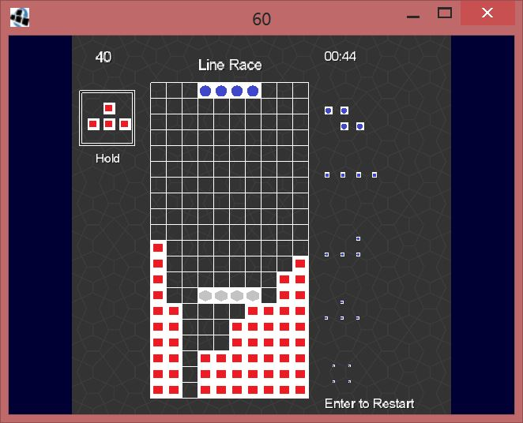

# Tris 
(In development)
Tris is a tetris focused on sprintMode.
It features hold and SRS rotations.

  

#### Tools used
Tris is written in Java with Android Studio.
It uses libGDX and thus is compatible with Android and Windows.
Tris can be launched by running the "desktop" configuration in Android Studio (no tested on other machines than mine).